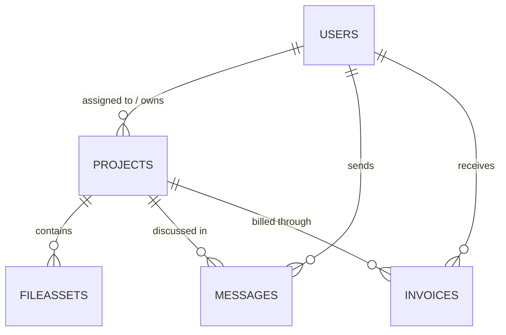

# Database Schema

## Collections

### `users`
- `name`
- `email`
- `password`
- `role` (`architect`, `client`, `admin`)
- `studioName`
- `assignedProjects[]`

### `projects`
- `title`
- `slug`
- `location`
- `projectType`
- `summary`
- `status`
- `heroImage`
- `year`
- `area`
- `duration`
- `coordinates`
- `modelUrl`
- `walkthroughUrl`
- `architect`
- `client`
- `files[]`
- `timeline[]`

### `fileassets`
- `name`
- `url`
- `key`
- `kind`
- `mimeType`
- `size`
- `storageProvider`
- `project`
- `uploadedBy`

### `messages`
- `project`
- `sender`
- `recipient`
- `body`
- `readAt`

### `invoices`
- `invoiceNumber`
- `project`
- `client`
- `amount`
- `dueDate`
- `status`
- `pdfUrl`
- `lineItems[]`

## Relationships

